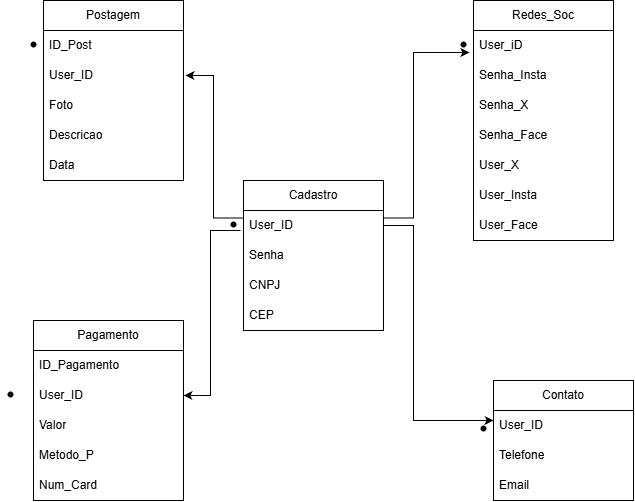

Documentação do Projeto:   
Social M Sync

2DS-Noite – Etec de Itaquera 1

Nome da Equipe:  
CornTeam

Nome do Sistema/App:  
Social M Sync

Integrantes:  
Arthur Santos Pereira  
Enzo Emilio Lopes  
Michael Kayo Rychard Botelho Sousa  
Zion De Jesus  

Descrição Geral:  
O Sistema visa agilizar as postagens em Redes Sociais. O sistema
iria centralizar várias redes sociais dentro dele e fará isso para que
o usuário possa postar apenas pelo Social M Sync e o app postaria
nas redes para ele.

RF1-  
Sincronizar suas Redes Sociais.  

RF2-  
Postar simultaneamente em todas as Redes Sociais.  

RF3-  
Armazenar suas postagens.  

RF4-  
Centralizar as notificações de todas as Redes Sociais.  

RF5-  
Permitir o carregamento de imagens e vídeos.  

RNF1-  
Manutenibilidade: Facilitar alterações e expansões do código.  

RNF2-  
Suporte: Chat privado e Botão de Suporte.  

RNF3-  
Segurança: Proteger contra vazamentos dados confidenciais dos usuários (Login/CNPJ, Senha, Dados Bancários, Login das Redes Sociais e Telefone).  

RNF4-  
Pico de Uso: Capacidade para suportar maior volume de acessos nos horários de pico e fins de semana.  

Dados confidenciais que o sistema irá proteger contra vazamentos:  
Login/CNPJ, Senha, Dados Bancários, Login das Redes Sociais e Telefone.  

O Pico de Uso:  
Seria razoável durante o horário de pico e maior número de acessos aos fins de semana.  

Análise de Falhas (Estudo de Caso):   
1-A)  
O sistema não tinha capacidade de suportar os 80 mil usuários, então forçou o sistema causando os travamentos e bugs causando um possível prejuízo.  

1-B)  
Sim, Durante a final do campeonato de futebol, quando o aplicativo teve um pico inesperado de 80 mil acessos simultâneos.  

1-C)  
Ocorreu falha no processamento de pagamento/pedido, cobrando o cliente sem enviar o pedido à cozinha (prejuízo financeiro e de reputação).  

2- Proposta de Solução:  
Realizaremos testes de carga para identificar o limite do sistema e orientar o seu dimensionamento. Além disso, faremos o monitoramento em tempo real em dias de pico para atuar rapidamente e desativar funcionalidades secundárias, garantindo o desempenho máximo do fluxo principal.  

Escolha do Padrão Arquitetural & Justificativa:  
Será escolhida a arquitetura Monolítica, pois é a que melhor se adapta ao nosso projeto acadêmico. Ela foi selecionada devido à facilidade de criação, rapidez nas funções, simplicidade, união dos componentes e eficiência.  

1. Inclusão dos Componentes Distribuídos no Diagrama;

Estratégia de Cache: Não pretendemos usar a memoria temporaria em nosso sistema. Não vemos necessidade disso. O sistema ira funcionar de forma imediata.

2. Mapeamento dos Padrões de Comunicação;

Fluxo 1 — Comunicação Síncrona (API REST):

Descreva uma funcionalidade que exige resposta imediata para o usuário.
R: Algo que deve ser obrigatoriamente imediato é a postagem executada pelo usuario. É necessario pois, se não for imediato, seria mais simples que o usuario postasse por si mesmo, sem utilizar o nosso sistema.

Fluxo 2 — Comunicação Assíncrona (Filas/Mensageria):

Descreva uma funcionalidade que pode ser processada em segundo plano (via fila) sem travar a navegação do usuário.
R: Nós teremos sistema de envio de email ou telefone para confirmar sua identidade no momento da criação da conta. Tambem se os usuarios escolherem a verificação de duas etapas.

Diagrama Arquitetural
Clique na imagem abaixo para visualizar o diagrama em alta resolução no repositório:

 

